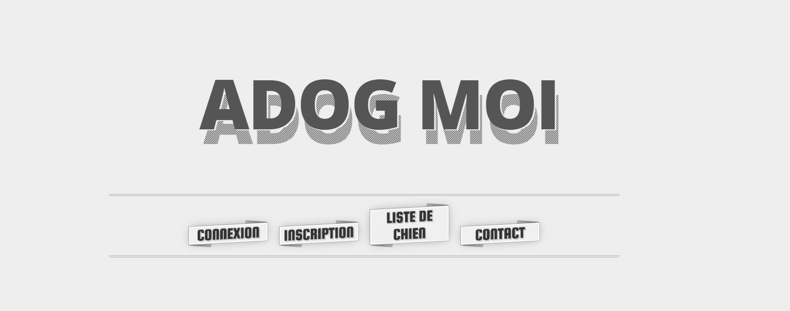
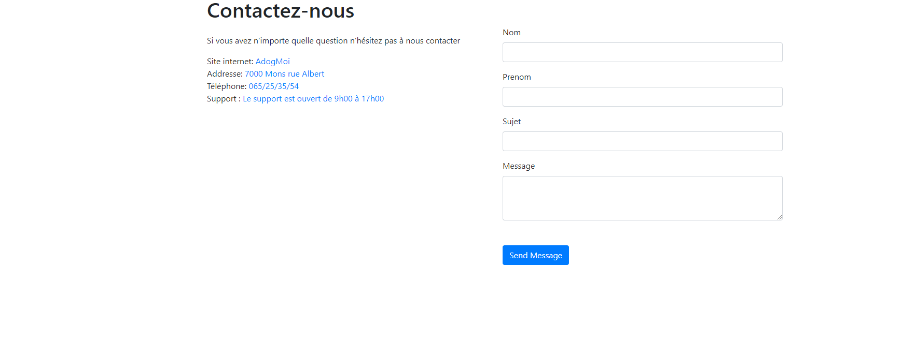

# AdogMe-Project-Php
simple project php (wihtout POO just for the request at my database, i use  the class PDO) CRUD with mysql  

# HOME

# CONNECTION

# CONTACT

# CRUD USER,DOG
there are options for update the fields of user,dog but there is a little bug with the database name with my request PDO, i dont have the time for resolve this bug now,maybe later i resolve this. 

# RUN THE PROJECT
set in your shell this command : php -S localhost:8000 
if you have any questions for this command, check the documentation https://www.php.net/manual/fr/features.commandline.webserver.php

